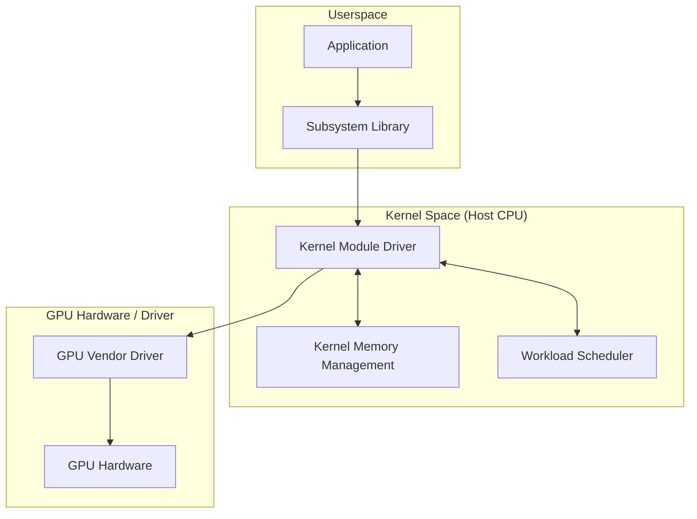

# Architecture Overview

This document describes the high-level architecture of the
GPU-accelerated kernel subsystem.

## System Diagram

## Component Descriptions

1.  **Kernel Module Driver**: The core entry point for the
    subsystem. Handles IOCTLs and system calls from userspace.
2.  **Workload Scheduler**: Manages the offloading of specific
    kernel tasks (e.g., encryption, compression) to the GPU.
3.  **Memory Manager**: Handles Zero-Copy or DMA transfers between
    CPU kernel memory and GPU memory.
4.  **GPU Kernels**: The actual logic (CUDA/OpenCL/HIP) running on
    the hardware.

## Data Flow

1.  Kernel intercepts a high-throughput task.
2.  Scheduler evaluates GPU availability.
3.  Memory Manager maps kernel buffers to GPU-accessible space.
4.  GPU executes the kernel.
5.  Results are synchronized back to the CPU kernel context.
